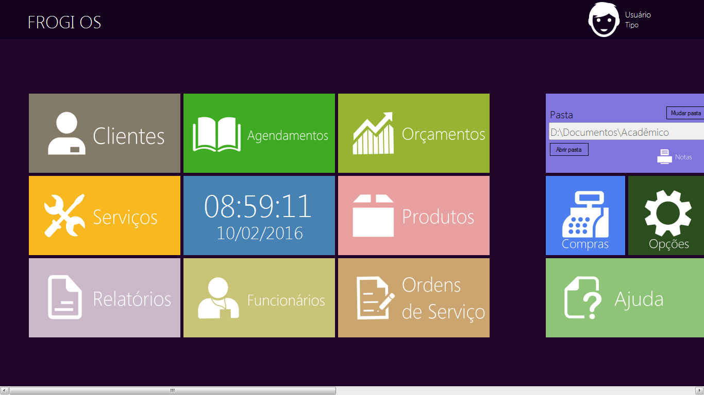
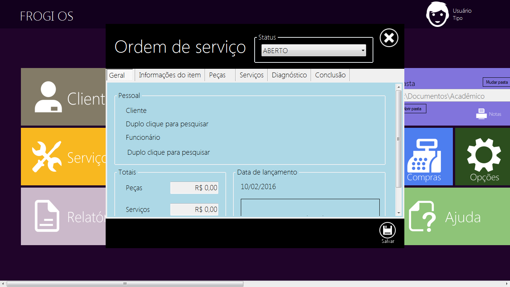

# Warning

This is the first time I've attempted to develop in C#, so the code is pretty messy and the app is unstable, but usable. I won't return to refactor this code. This was my first (and last) ride with C# and visual studio. Today I work more with web development.

# Frogi OS (Order of services)

A windows desktop application to manage order of services. You can also manage clients, products, services and much more!

<table>

	<tr>

		<td></td>
		<td></td>

	</tr>	

</table>

# I want to use / Contribute

To use this applicaiton you need to have Visual Studio in your machine. First download the source, import to Visual Studio and then compile the code. This application uses Firebird as database.  

# License

GNU GENERAL PUBLIC LICENSE V.3